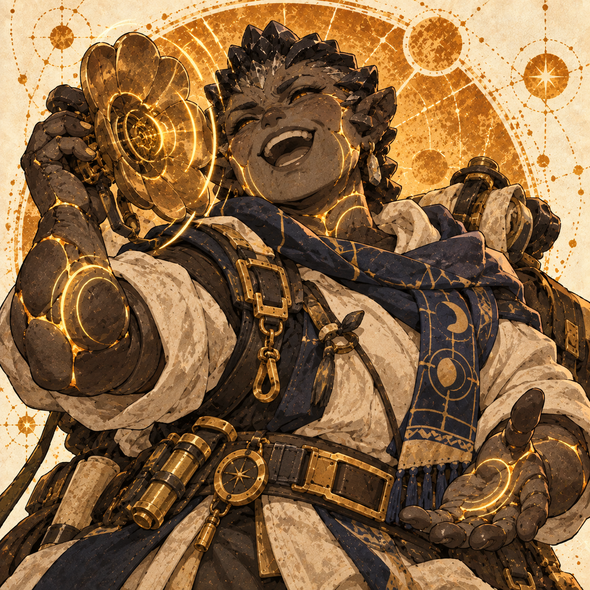
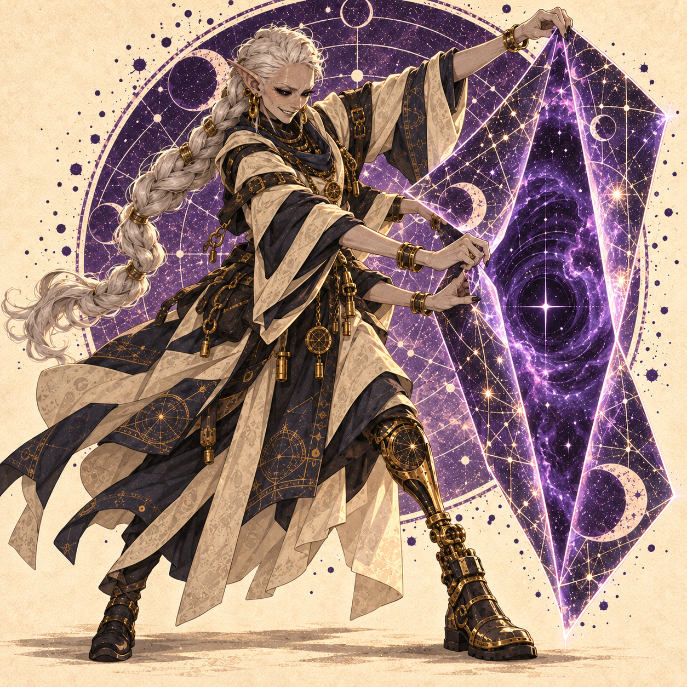
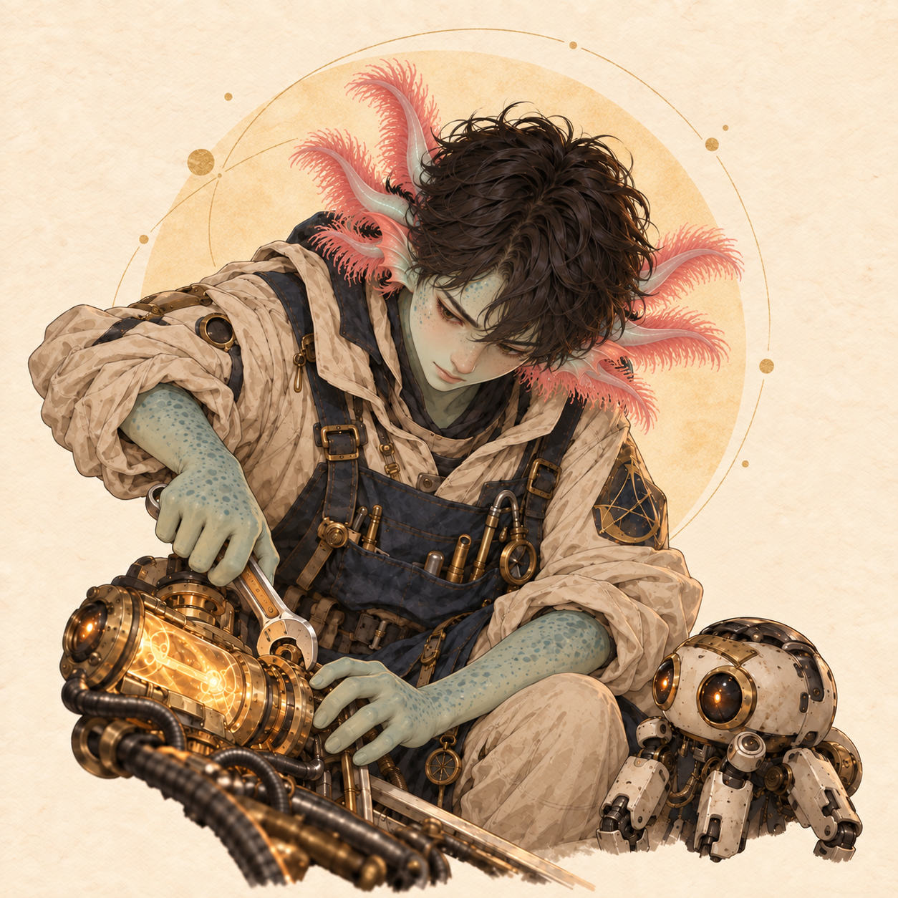
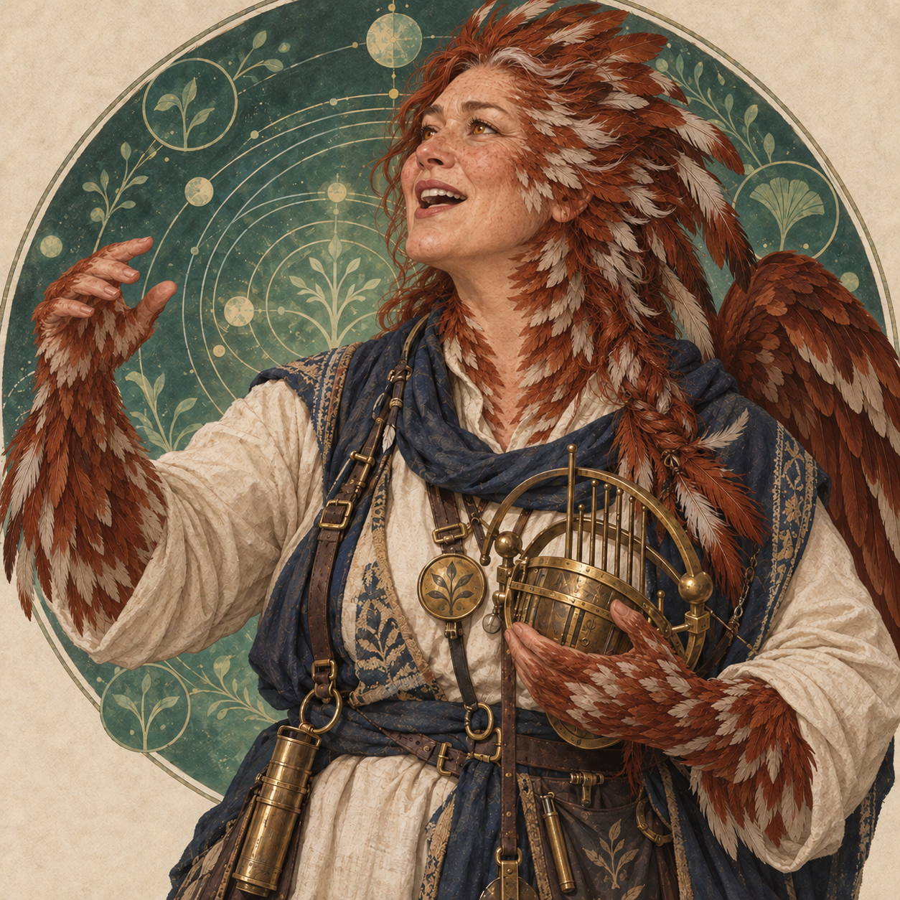
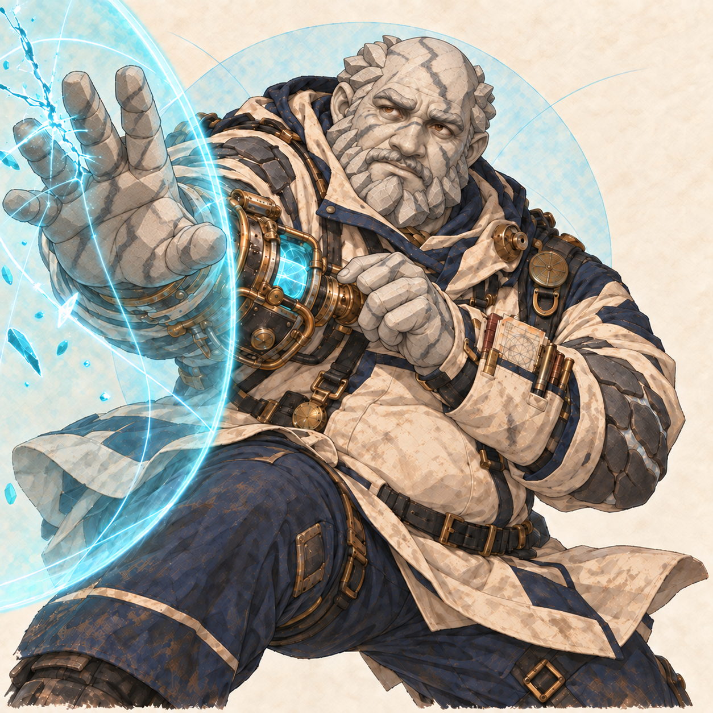
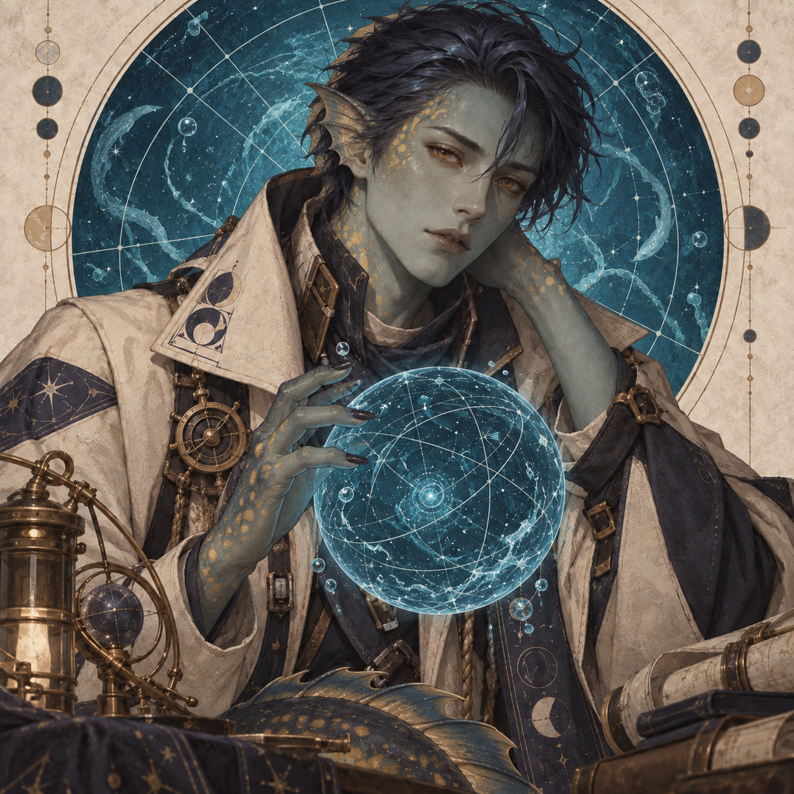

# Aether Weavers — the first six

Status: playable first-pass kits; lore and names are drafts for testing. Shared Aether pays for regular skills. Ultimates keep their own charge. Weaver is a learned discipline spanning shipboard jobs, not a species or a new element.

Start the isolated test voyage at `prototypes/spacology-v0.1.0.html?weavers=1`, or choose **Aether Weavers** on the title screen, then **Play the six-Weaver voyage**. Six characters start deployed at field level 5. This uses separate save and result keys; the main voyage is preserved. New test voyages start Hanae in Auto and Arunima with Full burst enabled. Existing saves retain their selected Aether modes; switch Hanae to Auto to use her refill skill. All six can also be discovered through the normal pack pools.

The crew’s common history begins with a failed transfer manifold. Hanae heard the wasted resonance; Ivara had somewhere to hold it; Arunima knew how to open a route for it. Roonie made the bypass, Daven made it safe to touch, and Veska kept six people working at one pace. They named the practice after what their hands were doing. It remains ordinary skilled work, with arguments, mistakes and personalities attached.

## Hanae Mori — Gatherer

46 · she/her · Porcelain stoneskin · energy · both

Hanae spent twenty years listening for cracks in the load-bearing terraces of Tannhul VI. When a survey platform failed, the repairs to her own stone skin acquired an inconvenient property: every stressed seam sang. She learned to distinguish pain from a useful signal, and eventually built an instrument that could return those signals as usable Aether. She calls the result a conversation, not a cure.

She is short, sturdy, loud when amused and exacting when someone handles her instruments. On Star Singer she records a different room each morning. Roonie tries to identify it from the recording; she sometimes includes the sound of his own snoring. She and Veska disagree about whether a perfectly repeatable note is a success. Her private ambition is to record the ship at rest, though she has never heard it entirely quiet.

- **Basic: Sounding Knock.** 125% attack and guard pressure. Generates 2 Aether.
- **Skill: Pass the Chord.** Spend 1 Aether, hit one specimen for 200% attack and mark it, then restore 5 Aether (+4 net, capped by the pool). Another ally’s next basic gathers +1 Aether; does not stack.
- **Ultimate: Every Seam Sings.** Hit every specimen for 300% attack, apply 2 survey marks and restore 4 shared Aether. Uses individual ultimate charge.
- **Passive: Golden Repairs.** Her basics generate 2 Aether instead of 1.

Auto uses her skill when the pool has room for a refill. Her +4 net skill and +4 ultimate fund Arunima’s burst; at zero Aether, basic first.

## Ivara — Reservoir

adult · he/him · Synthetic narwhal · void · both

Ivara was recovered from a relay buoy still announcing a route that had ceased to exist. His makers had given him an exquisitely sensitive spiral receiver and enough memory to hold a convoy’s return paths. They had not given him an instruction for what to do when nobody came back. He spent eleven years keeping the channel open before Navigator persuaded him that leaving was not the same as forgetting.

His original narwhal machine body is a deliberate, singular design: ivory plates, listening fins and a luminous spiral horn. He speaks softly and uses he/him. Aether storage is the practical use of the quiet intervals he preserves between echoes; his shelter briefly removes a threatened ally from an incoming hit’s route. He repairs cracked mugs without being asked and has recently begun choosing which distress recordings he wishes to keep. Arunima never calls his empty channels wasted space.

- **Basic: Echo Probe.** 125% attack. Generates 1 Aether.
- **Skill: Unwritten Shelter.** The most injured on-field ally ignores their next direct incoming hit. The shelter does not stack.
- **Ultimate: Safe Anchorage.** Grant every living ally 24 barrier and restore 6 shared Aether. Uses individual ultimate charge.
- **Passive: Room for an Echo.** Adds 2 shared Aether capacity while alive; does not add starting charges.

His larger pool lets you bank a burst. Shelter protects the front while your gatherers work.

## Arunima Das — Conduit

63 · she/her · Rift-elf · void · front

Arunima used to certify routes through Iseul’s folded orbits. Her maps were correct until a corridor changed during an evacuation. She held the exit with three hands and carried the last passenger with the fourth; the route took her leg when it closed. Her mechanical replacement is beautifully maintained, but she refuses a decorative cover because every successful journey should show what made it possible.

Tall, lean and silver-braided, she is patient with learners and intolerant of confident guesses. She joined Star Singer to map places that cannot be certified safe in advance. Ivara supplies the stored silences she uses as anchors; Hanae supplies the charge to open them. She tutors Daven with physical models and insists his inability to complete a timed written proof says nothing about his judgment. She keeps a blank page for the person who will correct her best map.

- **Basic: Find the Seam.** 125% attack and one survey mark. Generates 1 Aether.
- **Skill: Proof by Transit.** Spend 3 Aether to hit every specimen for 300% attack and delay each by 15 AV. With Full burst enabled, spend available Aether up to the current pool capacity: each extra charge adds 100 percentage points of attack damage and more guard pressure, reaching 800% at 8 or 1400% at 14. Auto spends less when a smaller hit can clear the current enemies. Respects another ally’s reservation. Roonie’s discount saves 1 charge without reducing damage.
- **Ultimate: No Distance Remains.** Hit every specimen for 500% attack and apply 2 survey marks. Uses individual ultimate charge.
- **Passive: Wider Aperture.** Full burst turns each extra Aether spent into a larger attack multiplier, scaling with the current pool capacity. It spends the available budget in one hit per specimen.

Enable Full burst for the payoff: 8 Aether becomes an 800% attack; 14 becomes 1400%. Hanae refills with skills, Ivara refills with his ultimate, and Roonie makes the same burst cost 1 less.

## Roonie Baelk — Tuner

16 · he/him · Axolotl amphiboid · energy · support

Roonie grew up in a wet-habitat maintenance family, taking apart the devices that told everyone else to stop taking things apart. His first independent robot delivered a replacement valve to the wrong apartment every morning for a month. He kept fixing its navigation until the recipient asked if it could stay. On Star Singer he is an apprentice, with supervised field duty and schoolwork that does not disappear when a manifold becomes interesting.

He has a human teenage face and lanky body, pale speckled amphibian skin and conspicuous feathery axolotl gills and fin-shaped amphiboid ears. His gills flare when a circuit finally works, making it impossible to pretend he knew it would. Hanae helps him hear losses in a conduit, and Daven checks every isolation switch before letting him touch it. Roonie wants to make useful machines that people can repair themselves; he is quietly offended by sealed housings.

- **Basic: Continuity Tap.** 125% attack. Generates 1 Aether. Every second basic tunes another ally’s next skill.
- **Skill: Borrow My Bypass.** Give another ally 10 barrier and reduce their next skill cost by 1 Aether, to a minimum of 1. Does not stack.
- **Ultimate: All Circuits Clear.** Restore 12 health and 25 individual ultimate charge to every living ally, including Roonie. Also restore 4 shared Aether once per cast.
- **Passive: Pocket Workshop.** Every second basic grants one ally a non-stacking, one-use skill discount.

Auto waits until a useful untuned ally needs a bypass; his basics still provide discounts while funding the pool.

## Veska Reed — Cantor

57 · she/her · Avian humanoid · growth · support

Veska was a rehabilitation worker before anyone paid her to sing. She learned to pace exercises around a patient’s breathing, and discovered that a repeated phrase could keep a tired room working together without asking anyone to be brave. Her weekly performances aboard Star Singer began as a favor to a homesick technician. She now has a permanent evening, a terrible folding stool and an audience that pretends not to know every song.

She is tall and soft-bodied, with a human face, russet and silver plumage, feathered arms and conspicuous avian eyes. Her voice is warm rather than spectacular; she knows when to leave space for another person. Hanae measures their rehearsals, which Veska considers a peculiar form of affection. She asks Ivara for sounds he remembers rather than sounds he can reproduce. Her healing builds a refrain through ordinary work, then releases what the crew has patiently gathered.

- **Basic: Keep the Refrain.** 125% attack. Generates 1 Aether and builds one Refrain, up to 3.
- **Skill: One More Verse.** Heal every living ally for 12 health plus 6 per Refrain, then consume all Refrains and restore 1 shared Aether per Refrain (up to 3). Healing harmonies apply.
- **Ultimate: The Room Sings Back.** Restore 36 health to every living ally. Uses individual ultimate charge.
- **Passive: Practiced Together.** Each basic builds one Refrain; her next skill turns those repetitions into stronger healing and returns up to 3 Aether.

Auto builds while the crew is healthy, and spends when someone falls below 75% health. Build mode still permits emergency healing.

## Daven Pell — Anchor

44 · he/him · Marble stoneskin · order · field

Daven has failed the same advanced certification eight years running. In a timed examination he loses his place, revises correct answers and runs out of paper. In a failing pressure chamber he checks the exit, finds the actual fault and tells everyone exactly what to do. He is already qualified for his shipboard work; the examination is the promotion he wants, not permission he has been working without.

Broad, fat and strong, with a bare veined-marble crown, layered angular marble locks at the sides of his head, a carved mineral beard and a patient human face, he carries a workbook whose pages have been replaced more often than its cover. Arunima teaches him with hinged models. Roonie draws circuits in the margins, then asks for help with the parts that must be safe. Daven’s barriers are ordinary, precise engineering. His gift is recovering a useful charge from an impact without letting the impact become somebody else’s problem. He intends to sit the examination again.

- **Basic: Check the Brace.** 125% attack and 6 personal barrier. Generates 1 Aether.
- **Skill: Hold the Line.** Hit one specimen for 225% attack, gain 32 personal barrier and draw more attacks until his next turn.
- **Ultimate: Everyone Behind Me.** Grant every living ally 40 barrier. Uses individual ultimate charge.
- **Passive: Recovered Load.** The first enemy hit absorbed by his barrier between his turns returns 1 Aether. Requires Daven to survive; capped by the shared pool.

Keep him on field. His own barriers let him return a little charge while protecting the gatherers.

## Silen — reused design, separate character concept

Adult newt-inspired amphiboid, working name Silen. The human redesign of the narwhal is reused here; Ivara retains his original synthetic narwhal body and identity. Silen has a human face and lean body, slate-teal amphibian skin, gold markings, fin-shaped ears and a finned tail. He has no spiral horn or axolotl gill fronds.

Silen surveys the changing boundaries between wet habitats and their surrounding machinery. He judges a seal by the tiny currents it permits, and dislikes instruments that report only “open” or “closed.” He seems languid because he waits for a complete reading before speaking. Roonie mistakes that stillness for boredom until Silen can describe a faulty valve from the sound transmitted through a water cup. His blue survey globe records pressure relationships, rather than Ivara’s missing routes.

Possible kit direction: an Order surveyor who marks a single specimen and steadily reduces the cost of maintaining protective effects. This is a portrait/lore concept, not a seventh implemented combat kit or member of the six-character test preset.

## Economy safeguards

Basic generation is once per action, never per hit. Named skill and ultimate refills also apply once per cast, capped by the shared pool. Hanae pays 1 before restoring 5, so she must basic at zero. Useful net-positive refill skills may cross a reservation even if the resulting pool is still below the reserved amount. Generation boosts and discounts are one-use and do not stack. Discounts have a minimum skill cost of 1. Arunima spends from 3 charges up to the current pool budget with Full burst enabled, gaining 100 percentage points of attack per extra charge; a discount gives the same multiplier for one fewer charge. Another ally’s reservation limits her spend. Nour retains his original +1-cost overcharge. Daven returns at most one charge between his turns, after absorbing an enemy hit and surviving it. Pool loss on a reservoir death is clamped immediately. Waves preserve charges; encounters start with 3. Ultimates continue to spend individual charge.

## Currency Wars reference

The requested reference is Honkai: Star Rail’s Currency Wars. Its dedicated skill-point teams combine large spenders with large refills; the documented [Sparkle kit](https://honkai-star-rail.fandom.com/wiki/Sparkle_%28Currency_Wars%29) restores multiple shared skill points with her ultimate. Our adaptation uses charge-based attack scaling and +4/+6 refill effects. It does not copy Currency Wars’ exact numbers or overflow-storage mechanic.

See [burst verification](../testing/weaver-burst.md) for the first-pass checks.

Current team rules: each living deployed Weaver adds 1 capacity to the base 6; Ivara and Aurel each add 2 more. The six-Weaver team holds 14 and still starts with 3. Arunima is front-only, Ivara is back-only, and Hanae can use either row. Auto limits burst spending when less damage can clear the remaining enemies. See [team priorities](aether-priorities.md) and [formation and recovery](formation-and-recovery.md).
